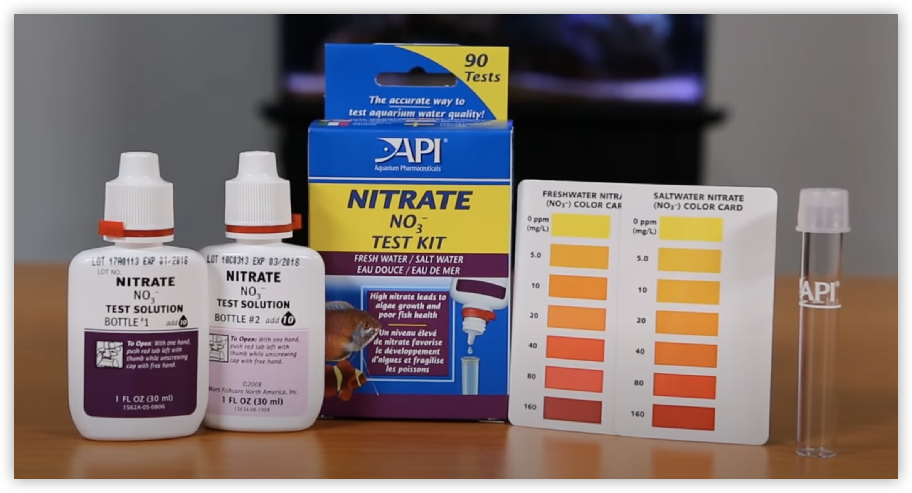
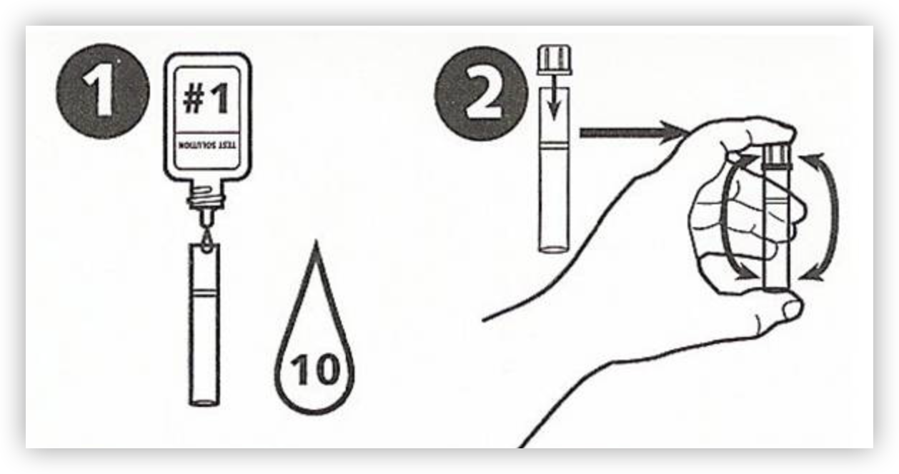
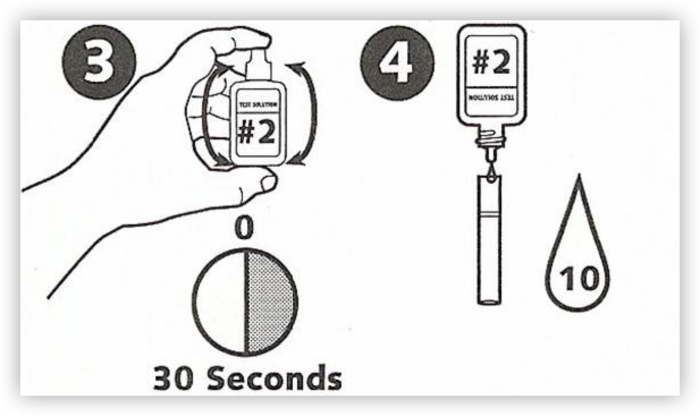
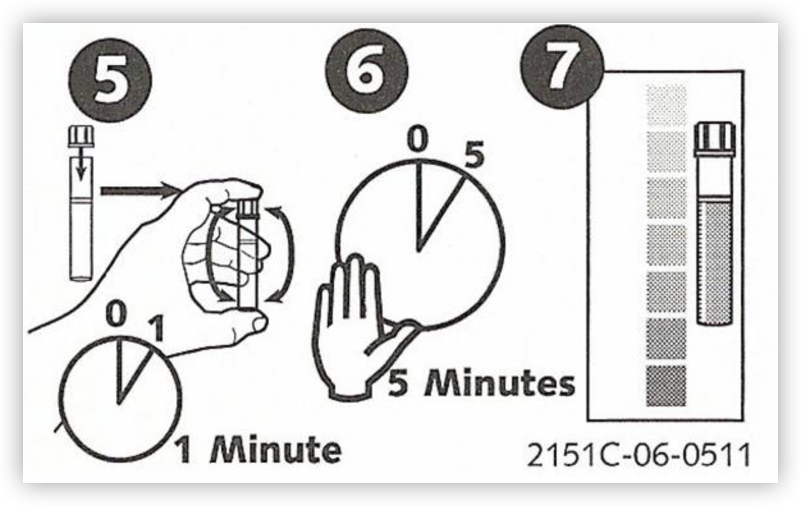

+++
thumbnail = "https://images.unsplash.com/photo-1605781231474-f60dea478e8a?auto=format&fit=crop&ixlib=rb-4.0.3"
title = 'API 질산염 테스트 키트 사용법'
description = 'API 질산염 테스트 키트를 사용하여 물의 질산염 함량을 쉽고 정확하게 측정하는 방법을 소개합니다.'
slug = 'how-to-use-api-nitrate-test-kit'
date = 2024-05-03T01:35:59+09:00
author = '야근반장'
draft = false
categories = ['물생활']
tags = ['질산염']
+++

물생활에 물의 질을 파악하는 것은 중요합니다. 어항물의 파라메터는 pH, 암모니아, 아질산, 질산염 등이 있습니다. 저는 어항의 과밀 여부를 알기 위해서 종종 질산염을 측정하고 있습니다.

이번 글에서는 API 질산염 테스트 키트의 사용법을 알아보겠습니다.

**1. 구성**

테스트 키트는 다음과 같은 구성품이 포함되어 있습니다.

- 시약 #1
- 시약 #2
- 테스트 용기
- 색상 차트

**2. 사용 절차**

우선 깨끗하게 세척된 테스트 용기에 어항물을 표시된 선까지 담습니다.

- 단계1: 시약 #1을 테스트 용기에 10방울 넣습니다.
- 단계2: 테스트 용기 뚜껑을 닫고 5,6회 정도 용기를 아래, 위로 흔들면서 섞어 줍니다.

- 단계3: <mark>시약 #2를 30초 이상 **강하게** 흔들어 줍니다(⚠️중요).</mark>
    > 시약 #2는 침전물이 생기는 용액인데 잘 섞어주지 않으면 테스트 결과가 정확하지 않을 수 있습니다.
- 단계4: 잘 섞은 시약 #2를 테스트 용기에 10방울 넣습니다.

- 단계5: 테스트 용기 뚜껑을 닫고 1분 정도 용기를 아래, 위로 흔들면서 섞어 줍니다.
- 단계6: 5분 정도 기다립니다.
- 단계7: 테스트 용기의 색과 색상 차트의 색을 비교하여 질산염의 농도를 판단합니다.

**3. 주의 사항**

- 시험 용액을 만들 때, 안전을 위해 손을 보호하는 장갑을 착용하세요.
- 정확한 테스트를 위해서 테스트 용기는 깨끗하게 세척하여 사용하세요.
- 사용 후 테스트 용기와 시험키트를 잘 닫아서 보관하세요.

참고로, 질산염은 40ppm 이하로 유지하는 것이 좋습니다.

이상으로 API 질산염 테스트 키트의 사용법에 대한 안내를 마치겠습니다. 
