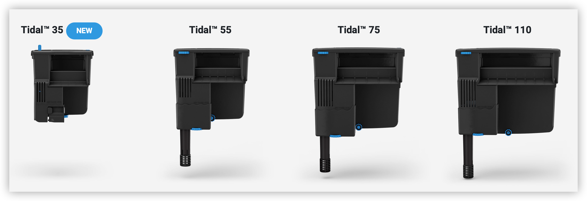
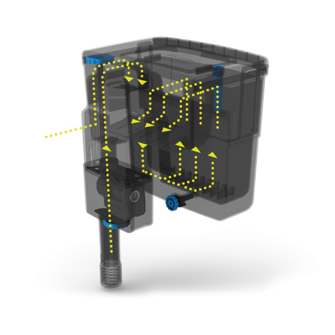

+++
title = '걸이식 여과기 추천'
description = 'Seachem Tidal 걸이식 여과기 리뷰'
thumbnail = "https://images.unsplash.com/photo-1519657635301-68bb60c798f7?q=80&w=2930&auto=format&fit=crop&ixlib=rb-4.0.3"
slug = 'review-seachem-tidal-hob'
date = 2024-05-08T20:54:58+09:00
draft = true
categories = ['물생활']
tags = ['여과기', '걸이식 여과기']
+++

여과기에는 여러가지 종류가 있습니다. 스펀지 여과기, 걸이식 여과기, 외부 여과기 등등...

제가 추천하는 제품은 이중 걸이식 여과기 중에 Seachem 社의 Tidal 여과기입니다. Seachem은 수초 및 물 관련 제품을 생산하는 세계적인 기업 중 하나입니다. 

Tidal 걸이식 여과기는 아래과 같은 제품이 있어서 수조 크기에 맞춰 구매할 수 있습니다.

| | [Tidal 35](https://amzn.to/3QGKzgr) | [Tidal 55](https://amzn.to/3UZhzmp) | [Tidal 75](https://amzn.to/3UZTdsS) | [Tidal 110](https://amzn.to/4dz4c3T) |
| ------------| -------- | ------- | ------- | ------- | 
| 최대 어항 크기 | 35 갤론(130 리터) | 55 갤론(200 리터) | 75 갤론(300 리터) | 110 갤론(400 리터) |
| 최대 유량 | 500 L/H | 1000 L/H | 1500 L/H | 2000 L/H |
| 소비전력 | 6W - (120 v - 60 Hz)   5W - (230 v - 50 Hz) | 6W - (120 v - 60 Hz)   5W - (230 v - 50 Hz) | 8W - (120 v - 60 Hz)   7W - (230 v - 50 Hz) | 12W - (120 v - 60 Hz)   10W - (230 v - 50 Hz) |
| 여과재 용량 | 0.7 리터  | 1.2 리터 | 1.9 리터 | 3.2 리터 |
| 제품 크기(cm) | 15.5 * 13 * 18  | 20.5 * 15.5 * 21.4 | 23.4 * 17.8 * 24.2 | 29.5 * 19.2 * 24.2 |

국내에도 여러 제품들이 있지만 해외 제품을 추천하는 이유는 다음과 같습니다.

**제품 기능 및 특징:**

1. **대용량 바스켓:** 대부분 걸이식 여과기를 사용하시는 분은 그대로 사용하지 않고 구입시 들어있던 필터 대신 여과재를 넣어 사용할 것입니다. Tidal 걸이식 여과기는 대용량 바스켓이 있어서 많은 여과재를 넣어 사용할 수 있습니다.

2. **효율적인 물 흐름:** 위와 같이 여과재를 넣어 사용하더라도 다른 여과기의 경우 물의 흐름이 여과재를 모두 통과하지 않아서 여과 효율이 떨어지거나 이를 보완하기 위해서 물의 흐름을 유도하는 칸막이를 별도로 만들어서 사용해야 하는 번거로움이 있습니다. Tidal 여과기의 경우 여과기로 들어온 물이 바스켓의 아래 부분으로 들어와서 모든 여과재를 통과하여 위쪽으로 나오게 되어 여과 효율이 극대화 됩니다.

3. **유막 제거:** 표면 skimmer가 있어서 유막 제거가 용이합니다.
   

4. **유량 조절:** 여과기의 입수량과 출수량을 조절할 수 있어서 필요에 따라 수류를 적절하게 조정할 수 있습니다. 단, Tidal 35 모델은 입수량은 조절이 안되고 출수량만 조절이 가능합니다.

5. **수중 모터:** 물을 끌어올리는 모터가 여과기 안이 아니라 어항 물에 바로 들어가는 구조이기 때문에 여과기 시작전에 여과기에 물을 채워줄 필요가 없습니다. 정전이 되더라도 다시 시작될 때 물을 채워 줄 필요가 없어서 안심하고 사용할 수 있습니다.

**다른 걸이식 여과기와 비교한 장단점:**

*장점:*

1. **자동 시작 및 자동 중단:** 전원이 꺼졌다가 다시 켜지면 자동으로 시작되고, 물 레벨이 내려가면 자동으로 중단되어 편리합니다.

2. **조정 가능한 흐름:** 다른 여과기에 비해 흐름을 조정할 수 있는 범위가 넓어서 어항의 크기와 필요에 맞게 적절한 조절이 가능합니다.

3. **소음:** 다른 여과기에 비해 조용합니다.

4. **부품 지원:** 사용되는 펌프, 임펠러 등 부품을 쉽게 구할 수 있습니다.

*단점:*

1. **구매 난이도:** 다른 여과기에 비해 가격이 다소 높은 편이고 국내에서 판매를 하고 있지 않기 때문에 해외 직구를 해야합니다.

2. **전원:** 110v를 사용하므로 220v -> 110v 트랜스를 사용해야 합니다.

**요약:**

Seachem Tidal 걸이식 여과기는 효과적인 여과 시스템을 제공하며 자동 시작 및 중단, 조정 가능한 흐름, 쉬운 유지 보수 등의 특징을 가지고 있습니다. 다소 높은 가격과 별도 변압기를 사용해야하는 단점이 있지만 충분히 매력적인 제품이라고 생각합니다. 혹시 구매를 원하시는 분을 위해서 아래에 링크를 남겨 둡니다.

- Seachem Tidal 35: [11마존](http://www.11st.co.kr/products/3526984450/share?gsreferrer=HYF1252) | [아마존](https://amzn.to/3QGKzgr) | [쿠팡](https://link.coupang.com/a/bBEcfd)
- Seachem Tidal 55: [11마존](http://www.11st.co.kr/products/5791701053/share?gsreferrer=HYF1252) | [아마존](https://amzn.to/3UZhzmp) | [쿠팡](https://link.coupang.com/a/bBEcQd)
- Seachem Tidal 75: [11마존](http://www.11st.co.kr/products/5907772261/share?gsreferrer=HYF1252) | [아마존](https://amzn.to/3UZTdsS) | [쿠팡](https://link.coupang.com/a/bBEcE2)
- Seachem Tidal 110: [11마존](http://www.11st.co.kr/products/3535775541/share?gsreferrer=HYF1252) | [아마존](https://amzn.to/4dz4c3T) | [쿠팡](https://link.coupang.com/a/bBEcy7)

다음 글에는 Tidal 걸이식 여과기를 좀 더 효율적으로 사용할 수 있는 사용 방법에 대해서 알아보도록 하겠습니다.

> 이 포스팅의 링크로 제품을 구매할 경우 일정액의 수수료를 제공 받아 블로그 운영에 큰 도움이 됩니다.

