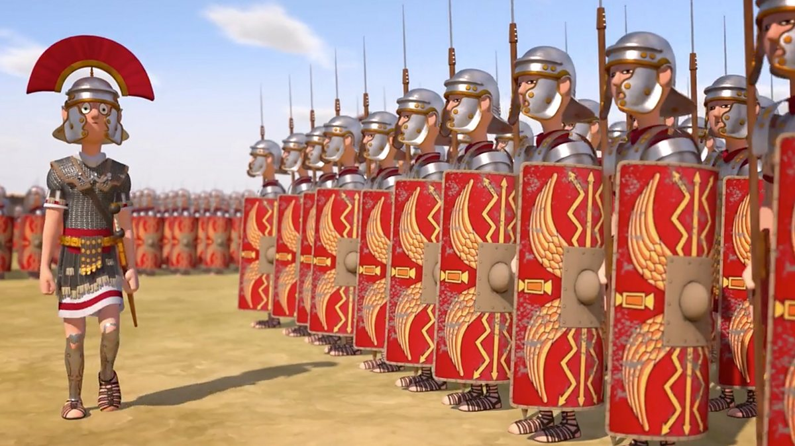

+++
title = '순교'
slug = 'martyrdom'
date = 2022-07-16
draft = false
thumbnail = 'https://images.unsplash.com/photo-1577972191368-fbbd766628a5?q=80&w=3862&auto=format&fit=crop&ixlib=rb-4.0.3'
categories = [ 'Christian' ]
tags = ['예화']
+++

주후 32년경 겨울에 로마 황제가 군인들을 포함한 모든 공무원에게 이교 신전에서 제사 드리지 않으면 그 직분을 잃게 되는 칙령을 내렸다고 한다.

300년 동안 무적의 사단이었던 12사단의 대장은 모여 있는 군사들에게 그 칙령을 읽어 주었다. 그리고 다음과 같이 말했다.

“12사단 군사들이여, 여러분은 여러 전투에서 용기를 보여 주었습니다. 이제 우리는 황제의 법에 순종함으로써 제국의 가이사에게 충성한다는 사실을 보여줍시다. 내일 우리는 신들에게 제사를 드릴겁니다.”

나중에 2명의 군인이 장군의 천막에 와서 말하기를, 이 사단에는 40명의 그리스도인이 있는데 그들은 이교신에게 제사를 드리지 않을 것이라고 하였다. 장군은 화를 내며 대답하였다.

“그들에게 말하시오. 만약 제사에 참여하면 괜찮거니와 만약 그렇지 않는다면, 무기를 압수당하고 그 직책에서 쫓겨날 것이며, 큰 고통을 당할것이요. 깊이 생각하고 좋은 쪽을 선택하라고 하시오.”

그날밤 진영에서 40명의 그리스도인들은 시편을 읽고 찬송을 불렀다. 

다음날 아침 제사 참여를 거부하자 그들은 처형하라는 장군의 명령이 떨어졌다. 팔과 목이 묶인 채 제사를 거부한 사람들은 얼어붙은 호수 근처로 끌려갔다. 그리고 해가 지자 그들은 벌거벗긴 채 호수 한가운데로 끌려갔다. 이들의 훌륭한 전과 때문에 그들에게는 자신들의 주장을 철회할 기회가 주어졌다. 호수 옆에는 그리스도에 대한 신앙을 부인하고 제사를 드리기로 작정한 사람을 위한 따뜻한 목욕탕이 준비되었다. 

어둠속에서 이들이 호수 가운데로 끌려가자 차가운 바람이 얼어붙은 호수위로 불었다. 목욕탕을 지키고 있던 보초병은 호수가에서 장작불을 피워 몸을 녹이고 있었다. 그 보초병은 그리스도인들이 얼어붙은 호수 가운데에서 찬송을 부르는 소리를 들을 수 있었다. 그러나 밤이 깊어지자 찬송소리가 약해졌다. 그 보초병은 그리스도인들의 중얼거리는 기도 소리위로 천사의 목소리가 나는 것을 들었다.

“그리스도의 좋은 군사 40명, 순교자 40명, 그리고 40개의 면류관이로다.”

그런데 이상한 일이 일어났다. 천사의 소리가 바뀌었다.

“그리스도의 좋은 군사 39명, 순교자 39명, 그리고 39개의 면류관이로다.”

그때 보초병은 발자국 소리를 들었다. 한 사람이 따뜻한 목욕탕이 있는 호숫가로 걸어 나오는 것이었다. 즉시 그 보초병은 무기를 놓은 채 소리질렀다.

“여기 내 옷을 입으시오. 내가 당신을 대신 하겠소!”

그 보초병은 자기 옷을 벗고, 벗은 채로 얼어 붙은 호수 가운데를 향해 뛰어갔다. 뛰어가면서 그는 노래를 불렀다.

“그리스도의 좋은 군사 40명, 순교자 40명, 그리고 40개의 면류관이로다.”

다음날 아침 장군은 죄수들을 끌어내라고 하였다. 얼어 죽은 시체들이 호수 한가운데 쌓여 있었다. 그 가운데는 보초병의 시체도 있었다. 그가 주님을 안 것은 그 짧은 순간 밖에 되지 않았지만 그는 주님을 위하여 자신의 목숨을 바칠 정도로 깊이 사랑하여, 주님의 품으로 돌아간 것이다.  

