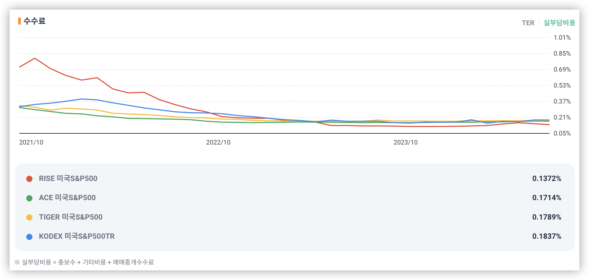
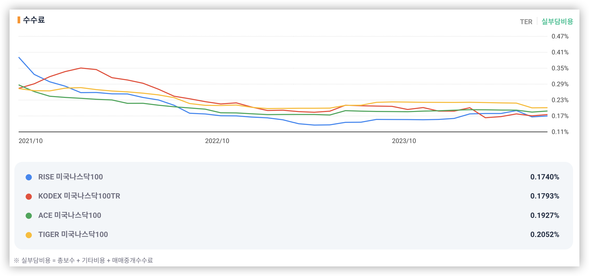
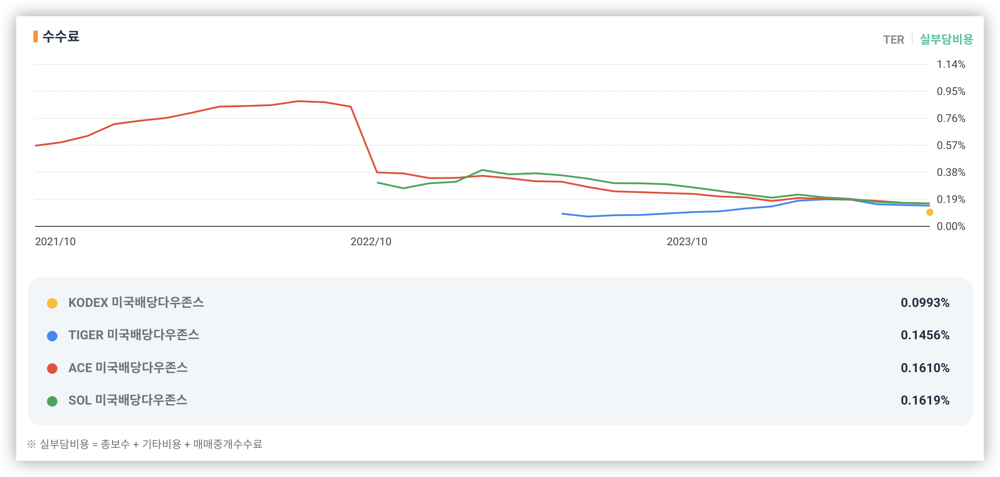

+++
title = 'ETF 수수료 비교(10월)'
slug = 'etf-expense-ratio-comparing'
description = "S&P500 / 나스닥100 / 미국배당다우존스 국내 ETF 수수료 비교 (10월)"
date = 2024-10-10T03:32:14+09:00
thumbnail = "https://images.unsplash.com/photo-1639754390580-2e7437267698?q=80&w=3841&auto=format&fit=crop&ixlib=rb-4.0.3"
draft = false
categories = ['자린고비']
tags = ['ETF', '수수료']
+++

안녕하세요. 이 글에서는 절세계좌에서 무지성으로 모으기 좋은 S&P500 / 나스닥100 / 미국배당다우존스 국내 ETF 수수료를 비교해 보겠습니다. 해당 ETF들은 꾸준히 인기를 얻고 있는 ETF들로 여러 운용사에서 출시되어 있습니다. 기초자산이 동일한 ETF라면 수수료가 조금이라도 저렴한 ETF를 매수하는 것이 좋습니다.

## S&P500

2024년 10월 기준 RISE에서 출시된 S&P500 ETF가 수수료가 0.1372%로 가장 낮네요.

## 나스닥100

2024년 10월 기준 RISE에서 출시된 나스닥100 ETF가 수수료가 0.1740%로 가장 낮네요.

## 미국배당다우존스

2024년 10월 기준 미국배당다우존스는 가장 최근에 출시된 KODEX 미국배당다우존스 ETF가 수수료가 0.0993%로 가장 낮네요.

RISE가 최근에 공격적으로 수수료 인하를 하고 있는 것으로 보이고 미국배당다우존스에서는 최근에 출시한 KODEX가 엄청 낮는 수수료를 무기로 점유율 확보에 나선 것 같습니다.

앞으로 눈에 띄는 수수료 변경이 있을시 다시 정리해서 글 올리겠습니다.
