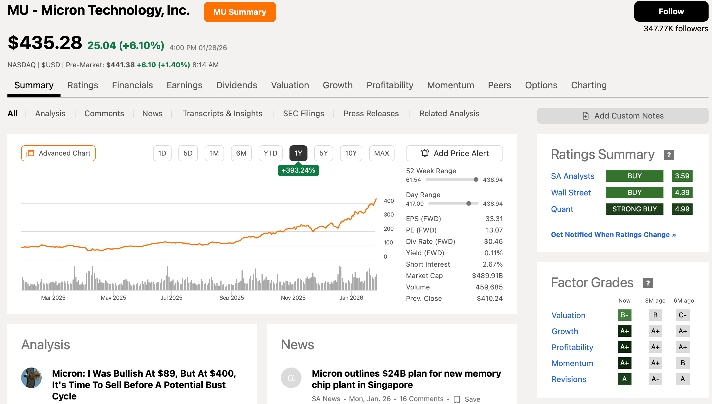

+++
title = '미국 주식 필수 도구, Seeking Alpha(시킹알파) 활용법 및 유료 구독 할인 팁'
date = 2026-01-29T10:00:00+09:00
slug = 'seeking-alpha-tips'
description = "미국 주식 투자자라면 한 번쯤 들어봤을 시킹알파! 무료와 유료의 차이점부터 강력한 퀀트 레이팅 활용법, 그리고 $25 할인 가입 링크까지 정리해 드립니다."
thumbnail = "https://play-lh.googleusercontent.com/o1CiIOLqrAkPdgMbZr9TRJ-MAdEjT7E_QdxS8I2Sex_hLufTIyTP3q_bMdYGgP3BgCjQ=w3840-h2160-rw"
categories = ['스노볼']
tags = ['미국주식', 'Seeking Alpha', '시킹알파']
affiliate = true
draft = false
+++

미국 주식을 하다 보면 "이 종목, 지금 사도 될까?"라는 고민에 빠질 때가 많습니다. 구글링이나 뉴스만으로는 부족함을 느낄 때, 전 세계 고수들의 인사이트를 한곳에 모아둔 **시킹알파(Seeking Alpha)** 는 최고의 가이드가 되어줍니다.

👉 [**Seeking Alpha $25 할인 및 14일 무료체험 링크 클릭**](https://seekingalpha.com/subscriptions/refer-a-friend?source=refer_friend_link&user_referrer=91b2f66cc36855b50f4ed68b)

오늘은 시킹알파가 왜 미국 주식 투자자의 필수 사이트인지, 그리고 유료 기능을 어떻게 100% 활용할 수 있는지 핵심만 짚어드릴게요!

---

## 1. Seeking Alpha란 어떤 사이트인가요?

시킹알파는 세계 최대의 **크라우드소싱 기반 금융 콘텐츠 플랫폼** 입니다. 단순히 뉴스만 전달하는 것이 아니라, 수만 명의 전문 애널리스트와 실전 투자자들이 직접 작성한 기업 분석 리포트를 제공합니다.

* **집단지성:** 한 종목에 대해 '매수' 의견과 '매도' 의견을 동시에 읽으며 균형 잡힌 시각을 가질 수 있습니다.
* **방대한 데이터:** 10년 치 이상의 재무제표, 실적 발표 대본(Transcripts), 배당 기록 등을 한눈에 볼 수 있습니다.

<!--  -->

---

## 2. 무료 vs 유료(Premium), 무엇이 다른가요?

무료 버전도 훌륭하지만, 본격적으로 종목을 발굴하고 싶다면 **Premium(프리미엄)** 구독이 강력한 무기가 됩니다.

| 기능 | Basic (무료) | Premium (유료) |
| :--- | :---: | :---: |
| 분석 리포트 열람 | 제한적 (월 1~2개) | **무제한** |
| **퀀트(Quant) 레이팅** | 사용 불가 | **전 종목 확인 가능** |
| 주식 스크리너 | 기본 필터 | **고급 필터 (퀀트 기준)** |
| 배당 등급 (Safety/Growth) | 확인 불가 | **상세 등급 제공** |
| 광고 제거 | 포함 | **광고 없음** |

---

## 3. 프리미엄의 꽃: 퀀트 레이팅(Quant Ratings) 활용법

제가 프리미엄을 구독하는 가장 큰 이유는 바로 **'퀀트 레이팅'** 때문입니다. 알고리즘이 수익성, 성장성, 가치 등을 종합해 점수를 매기는데, 이 점수만 잘 활용해도 큰 실수를 줄일 수 있습니다.

### ✅ 이런 기능을 꼭 써보세요!
1.  **Strong Buy 종목 발굴:** 퀀트 점수가 높은 종목들만 모아서 보여주는 스크리너 기능을 통해 숨겨진 보석을 찾을 수 있습니다.
2.  **Portfolio Health Check:** 내 포트폴리오를 연동하면, 현재 내가 보유한 종목들의 건강 상태(점수)를 실시간으로 모니터링해 줍니다.
3.  **Dividend Grades:** 배당주 투자자라면 해당 기업의 배당이 얼마나 안전한지(Safety), 앞으로 늘어날 가능성(Growth)이 있는지 등급으로 확인하세요.

---

## 4. 혜택 받고 가입하는 방법 (리퍼럴 할인)

시킹알파 프리미엄의 정가는 연간 약 $299입니다. 하지만 아래 **리퍼럴 링크**를 통해 가입하시면 신규 회원 한정으로 특별한 혜택을 받으실 수 있습니다.

* **혜택 1:** 14일 동안 프리미엄 기능을 **무료 체험**해 볼 수 있습니다.
* **혜택 2:** 첫 연간 구독 결제 시 **$25 할인**이 즉시 적용됩니다.

직접 써보시고 나에게 맞지 않는다면 체험 기간 내에 언제든 해지할 수 있으니 부담 없이 시작해 보세요!

👉 [**Seeking Alpha $25 할인 및 14일 무료체험 링크 클릭**](https://seekingalpha.com/subscriptions/refer-a-friend?source=refer_friend_link&user_referrer=91b2f66cc36855b50f4ed68b)

---

## 마치며

미국 주식은 정보의 비대칭성이 큰 시장입니다. 시킹알파 프리미엄은 개미 투자자가 기관 투자자에 준하는 데이터를 가질 수 있게 해주는 가장 가성비 좋은 도구라고 생각합니다. 

여러분의 성투를 기원하며, 궁금한 점은 댓글로 남겨주세요!

