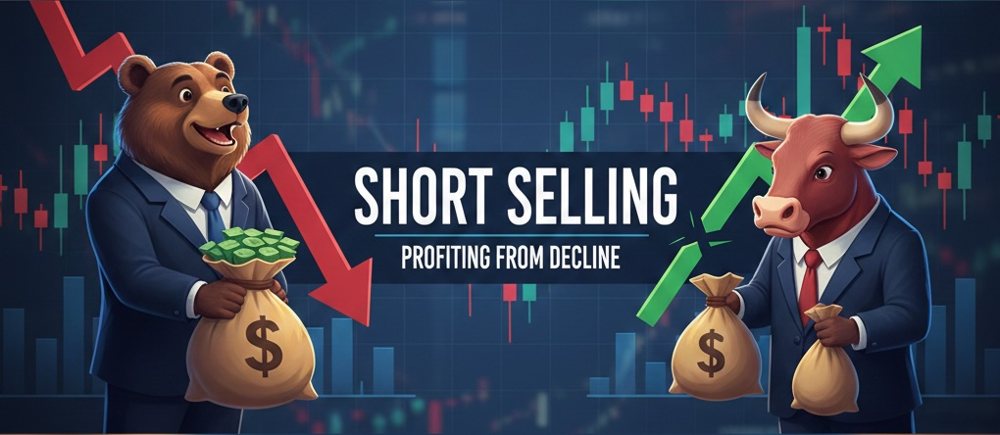

+++
title = '공매도란? 주식 초보자를 위한 완벽 가이드 feat. 헤지펀드'
date = 2026-02-06T01:00:00+09:00
slug = 'short-selling-hedge-fund-guide-for-beginners'
description = '주가 하락으로 돈을 버는 공매도의 원리부터 헤지펀드의 전략, 그리고 2026년 한국 시장의 최신 동향까지 초보자도 쉽게 이해할 수 있도록 설명합니다.'
thumbnail = "https://images.unsplash.com/photo-1611974789855-9c2a0a7236a3?q=80&w=2370&auto=format&fit=crop"
draft = false
categories = ['스노볼']
tags = ['공매도', '헤지펀드', '주식투자']
+++

## 들어가며

"공매도가 뭐야?", "헤지펀드는 또 뭐지?" 뉴스를 보다 보면 자주 나오는 용어지만 처음 들으면 도대체 무슨 말인지 이해하기 어렵다. 특히 2026년 2월 초 코스피가 급락했을 때도 공매도와 헤지펀드 이야기가 많이 나왔다. 오늘은 이 두 개념을 주식 초보자도 쉽게 이해할 수 있도록 풀어보겠다.

## 공매도란? 없는 주식을 판다고?

### 공매도의 기본 개념

공매도(空賣渡, Short Selling)는 한자 그대로 '없는 것을 판다'는 뜻이다. 일반적인 주식 투자는 주식을 사서(매수) 가격이 오르면 파는(매도) 방식인데, 공매도는 그 순서가 반대다. 주식을 먼저 빌려서 팔고, 나중에 다시 사서 갚는 것이다.

쉽게 말해, 주가가 떨어질 것이라고 예상할 때 수익을 내는 투자 방법이다. 주가 하락에 베팅하는 것이기 때문에 일반 투자와는 정반대의 전략이라고 볼 수 있다.

### 공매도 작동 원리 - 예시로 이해하기

구체적인 예시를 통해 공매도가 어떻게 작동하는지 알아보자.

**상황 설정:**

- 현재 A회사 주식 1주 = 10만 원
- 나는 A회사 주가가 곧 떨어질 것이라고 예상

**Step 1: 주식을 빌려서 판다**

- 증권사에서 A회사 주식 10주를 빌린다
- 빌린 주식 10주를 즉시 시장에 판다
- 내 계좌에 100만 원이 들어온다

**Step 2: 주가 하락을 기다린다**

- 일주일 후 예상대로 A회사 주가가 5만 원으로 하락

**Step 3: 주식을 사서 갚는다**

- 5만 원에 A회사 주식 10주를 다시 산다 (50만 원 지출)
- 산 주식 10주를 증권사에 돌려준다
- 최초 100만 원 - 재매수 50만 원 = **50만 원 수익** (대여 수수료 제외)

이처럼 공매도는 '높을 때 팔고 낮을 때 사는' 원리로 수익을 낸다.

### 공매도의 위험성

하지만 예상과 달리 주가가 상승하면 어떻게 될까? 주식을 10만 원에 팔았는데 나중에 12만 원이 되면, 120만 원을 들여서 10주를 사야 한다. 결국 20만 원의 손실이 발생하는 것이다.

더 무서운 것은 공매도의 손실은 이론상 무한대라는 점이다. 일반 매수는 주가가 0원이 되어도 투자금만큼만 잃지만, 공매도는 주가가 계속 오르면 손실이 끝없이 커진다.

## 공매도의 두 가지 유형

### 차입 공매도 (Covered Short Selling)

먼저 주식을 빌린 다음 파는 정상적인 공매도 방식이다. 한국에서는 이 방식만 합법적으로 허용된다. 주식을 빌리는 대가로 이자를 지불해야 하며, 증권사를 통한 대주거래나 장외에서의 대차거래를 통해 이루어진다.

### 무차입 공매도 (Naked Short Selling)

주식을 실제로 빌리지 않고 먼저 파는 불법적인 방식이다. 한국에서는 금지되어 있지만, 전산시스템의 허점을 노려 실행되는 경우가 있다. 과도한 물량이 시장에 쏟아져 주가를 비정상적으로 하락시키는 부작용을 낳는다.

## 헤지펀드란? 공매도와 무슨 관계?

### 헤지펀드의 개념

헤지펀드(Hedge Fund)는 '헤지(hedge)', 즉 '위험을 회피한다'는 의미에서 나온 이름이다. 일반 펀드와 달리 다양한 투자 전략을 활용하여 시장 상황과 관계없이 수익을 추구하는 고위험·고수익 펀드다.

헤지펀드는 정부 규제가 적고, 소수의 부유한 개인이나 기관투자자만 투자할 수 있다. 일반 펀드가 주식 상승에만 베팅한다면, 헤지펀드는 주가 하락, 환율 변동, 채권 금리 등 모든 방향에 베팅할 수 있다.

### 헤지펀드와 공매도의 관계

공매도는 헤지펀드의 핵심 투자 전략 중 하나다. 헤지펀드는 공매도를 활용하여 다음과 같은 목적을 달성한다:

1. **하락장에서의 수익 창출**: 시장이 하락할 때도 공매도를 통해 수익을 낸다
2. **헤지(위험 회피)**: 보유한 다른 주식의 리스크를 공매도로 상쇄한다
3. **과대평가된 기업 발굴**: 회계 부정이나 거품이 낀 기업을 찾아내 공매도한다

실제로 2001년 미국 에너지 기업 엔론의 회계 장부 조작, 2020년 니콜라의 사기 행각도 모두 공매도를 활용한 헤지펀드 투자자들이 밝혀냈다.

### 숏 커버링과 숏 스퀴즈

헤지펀드가 공매도를 청산할 때 일어나는 현상도 알아두면 유용하다.

- **숏 커버링(Short Covering)**: 공매도 포지션을 정리하기 위해 주식을 다시 사들이는 행위. 대규모 매수세가 유입되면서 주가가 상승할 수 있다
- **숏 스퀴즈(Short Squeeze)**: 공매도 투자자들이 주가 상승으로 손실을 보자 일제히 주식을 사들이면서 주가가 폭등하는 현상. 2021년 미국의 게임스톱 사태가 대표적인 예다

## 공매도의 순기능과 역기능

### 순기능: 시장의 파수꾼

공매도는 증권시장에서 중요한 순기능을 한다:

1. **거품 제거**: 과대평가된 주식의 가격을 적정 수준으로 조정한다
2. **불공정 거래 적발**: 회계 부정, 사기 기업을 조기에 발견한다
3. **유동성 공급**: 매도 의견을 반영하기 쉬워 거래가 활발해진다
4. **가격 발견 기능**: 매수와 매도 양쪽 의견이 균형을 이루어 적정 가격을 찾는다

### 역기능: 시장 교란의 우려

반면 부작용도 존재한다:

1. **무분별한 주가 하락 유도**: 과도한 공매도는 건전한 기업의 주가도 떨어뜨린다
2. **불법 공매도**: 무차입 공매도로 시장 질서를 어지럽힌다
3. **개인투자자 피해**: 정보력이 부족한 개인이 기관의 공매도 공세에 손실을 본다

## 2026년 한국 시장의 공매도 현황

2026년 2월 현재, 한국에서는 공매도에 대한 논쟁이 계속되고 있다. 정부는 2024년 11월부터 공매도를 금지했고, 무차입 공매도를 방지하는 전산시스템을 구축 중이다. 

시장 참여자들의 의견은 엇갈린다. 공매도 금지 찬성론자들은 개인투자자 보호와 시장 안정을 주장하고, 반대론자들은 시장 왜곡과 유동성 감소를 우려한다. 정부는 2025년 3월 31일 전 종목에 공매도를 재개했으나, 무차입 공매도 근절을 위한 시스템 개선이 계속되고 있다.

## 주식 초보자가 알아야 할 것들

### 공매도는 고위험 투자

공매도는 일반 주식 투자보다 훨씬 위험하다. 손실이 무한대로 커질 수 있고, 주식 대여 비용도 부담해야 한다. 초보 투자자라면 충분한 경험을 쌓기 전까지는 피하는 것이 좋다.

### 공매도 정보 확인하기

금융감독원과 한국거래소는 종목별 공매도 현황을 공개한다. 특정 종목에 공매도가 급증하면 기관들이 하락을 예상한다는 신호일 수 있으니 참고할 만하다.

### 헤지펀드 동향 주시하기

대형 헤지펀드의 공매도 포지션은 시장에 큰 영향을 미친다. 글로벌 헤지펀드들이 어떤 종목을 공매도하는지 뉴스를 통해 확인하면 시장 흐름을 이해하는 데 도움이 된다.

## 마치며

공매도는 단순히 '나쁜 것'이나 '좋은 것'으로 규정하기 어려운 복잡한 투자 기법이다. 헤지펀드가 이를 활용해 시장의 비효율을 찾아내고 수익을 추구하는 것은 자본주의 시장의 자연스러운 모습이다.

하지만 불법 공매도와 과도한 매도 공세는 분명 문제다. 투명하고 공정한 시장 질서를 확립하면서도 시장의 가격 발견 기능을 유지하는 균형점을 찾는 것이 중요하다.

주식 초보자라면 공매도를 직접 시도하기보다는, 이러한 시장 메커니즘을 이해하고 자신의 투자 판단에 활용하는 것이 현명하다. 시장에는 다양한 참여자들이 각자의 전략으로 움직이고 있다는 점을 기억하자.
